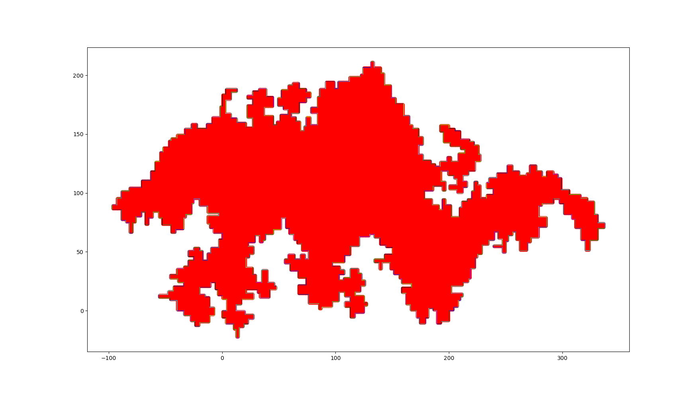
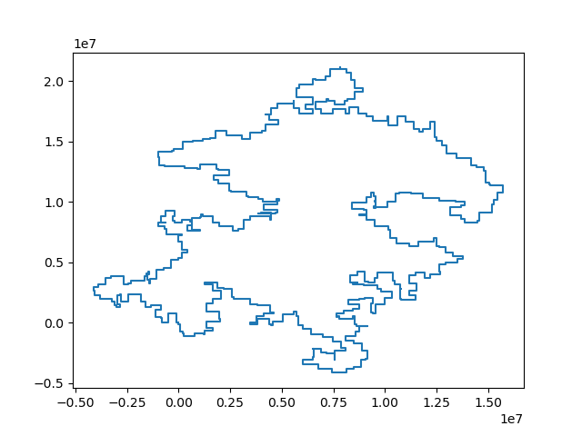
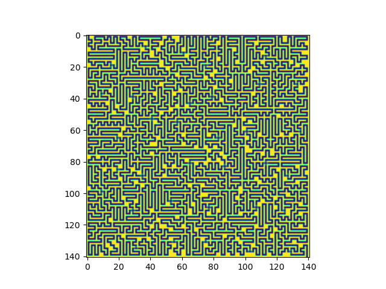

# Advent of Code 2023
## using Python

### Day 1:
I just slammed out some gross python code, that second
part was tough.

### Day 2:
This felt a little easier than day one to me, but there
was more to parse out correctly. I made the script less
gross this time.

### Day 3:
This was brutal! I basically brute forced it - and the
approach I took worked, but I had some weird edge cases
and bugs to figure out. In particular, I had one bug
that missed a single gear in my input data, and I spent
a while tracking it down. It was related to the number
being adjacent to the symbol and also being the last
number in the line. 🤦‍♂️

There's probably a really nice sliding window approach
that would make more sense for this problem, looking
forward to seeing other solutions.

### Day 4:
This one was pretty easy, not complaining though! For part
one I used a dictionary to track the count of winning numbers
and then added their count to the match count for each of the
numbers we had in the winning set. For part two, I used
another dictionary to track the current count of cards, when
cards win they update their count in the dictionary by however
many copies there are of that card.

### Day 5:
I had a lot of trouble with the second part of this one. First
was only a few minutes, but the second part couldn't be brute
forced, at least in the time that I had. I ended up looking
at the subreddit for help... we have to move through the maps
in ranges instead, which is no big deal if the seed range doesn't
overlap the map range. If it's overlapping, you can split it into
two ranges, map the overlapping range through the map, and leave
non overlapping ranges alone. It's day 5! I'm a little scared for
the rest of the month. 😅

### Day 6:
Nice! This was an interesting problem. I found it easier than
yesterday's problem. I didn't even bother with trying to brute
force the solution for part 2 this time. The max distance you
can travel in the race is if you wait until duration / 2 seconds
to start moving. So with that, you can start at the max duration
and binary search down to the left and the right to find the
first time where you won't make it on each end - all the times
in between will be the ways you can win. There's probably a math
solution to this one, but I didn't think about it too hard.

Update:
Ah could have used math!
  speed * (duration - speed) = speed ^ 2 + speed * duration
  record < speed ^ 2 + speed * duration
  record = (speed ^ 2 + speed * duration)
  speed ^ 2 + speed * duration - record = 0

  use quadratic formula to solve for speeds at the edges! Should
  have thought about it a bit longer before jumping to binary search!

### Day 7:
This was a super fun problem! A bit tricky, I sorted first on the
hand rank and then to get a value for card rank between hands that
have the same hand rank, I mapped the values to a number using
card_value * 13 ^ card_index, 13 because there are 13 cards - it's
like a base 13 number system. Made a couple mistakes handling the
J's in the second part but I was able to track them down. Code is
a mess today, might clean it up tomorrow.

### Day 8:
The second part was hard for me to wrap my head around for this one.
Got a hint about the individual paths being fast to compute from
a discord convo and that made it clear to me. Get the length of the path
for each starting node along the directions and then find the lcm of
all of them. The number is huge, so brute force would have taken
impossible or just really slow at least. The LCM trick also only works
for a specific set of inputs (eg the paths are all multiples of the
set of directions, etc) - I won't be surprised if there's a more
general solution that ends up being required for a problem later in
the month...

### Day 9:
This one felt pretty straightforward, I think he was giving us a break
after a strong start.

### Day 10:
This was the hardest day for me for sure. I had the idea figured out for both
parts, but I ran into a lot of problems debugging and implementing correctly. I
definitely could have used a better algorithm for part 1, I'm running two
DFS, one to make an adjacency list and one to find the nodes in the path,
mostly because I just wanted to work with the adjacency list (dictionary).
I know the algorithm for part 2 right away because I've seen it before, I was
trying to implement a simple version of it but I was having trouble with
separating "crossing" the path with being "parallel but above or below the
path". I ended up just looking up an implementation of "point in poly" instead
of writing a simple custom one and that seemed to do the trick.

Glad this one was on a Sunday!

Reviewing other's solutions:
- I removing information to try to work with a simplified version of the problem
for the second part. I switched to using a 1 for anything in the path and a 0
for anything not in the path. The problem with this is that it was tricky to
determine if there was a crossing or now when there was an extended parallel
path. The solution I saw used only a subset of the types of pipes (eg only 7, |,
and L) - to count the crossings. This automatically handles the extended
parallel paths because they don't have any crossings.

Also definitely don't need two DFS for part 1, there's only two connections on
the nice path so you can just make the adjacency list and then do a DFS from
there to get the path.

References:
- https://www.baeldung.com/cs/dfs-vs-bfs-vs-dijkstra
- https://stackoverflow.com/questions/66585264/php-find-one-or-more-enclosed-area-in-a-two-dimensional-array
- https://www.wikiwand.com/en/Point_in_polygon#Ray_casting_algorithm
- https://stackoverflow.com/questions/217578/how-can-i-determine-whether-a-2d-point-is-within-a-polygon

### Day 11:
This one was straightforward - probably trying to give us a break after
yesterday's problem. For part 1 I just naively expanded the grid and then
calculated the distances. For part 2, it would have been impossible to
expand the grid that much, but you can just track the number of expanded
rows and columns between the two galaxies. That tells you how many new
rows/cols are added on expansion so you can add that to the distance.

### Day 12:
This is hard! I managed to naively solve part 1 by recursively generating
all the options and counting the valid ones. It's not going to work for
part 2 though. I'm going to have to think about this one more...

Like the plant problem below, I think this a dp problem - I have no idea
how to set up the subproblems at the moment though... tbd.

Update:
- need to make the subproblems smaller - eg chop off the part of the string that
  has already matched and the groups that have been matched. So I think the
  function almost is correct but it needs to consider the whole string all the
  time. If the chunks are smaller more of them will get cached and it might
  actually be fast enough to run the input.

Finally got it! Though I did not do it on my own, unfortunately. I was on the
right track, but I wasn't able to figure out the correct way to form the
subproblems so that it could be easily cached. The trick is that once you finish
a group, you basically don't care about how you got there (eg you want to just
add all the possible ways there were to resolve it). You can cache on where you
are in the string, the current group you're working on, and the hash count (eg
count of broken springs). I don't know that the idea of resolving one group at a
time like that would have occurred to me on my own, but I'm glad I got to
struggle with it for a while before looking at the subreddit.

Refs:
- https://leetcode.com/problems/number-of-ways-to-divide-a-long-corridor/
  - this problem has some similar vibes
- this also reminds me of the sticks and bars combinations problem but I'm not
  sure how to apply that exactly at the moment (https://handwiki.org/wiki/Stars_and_bars_(combinatorics))

### Day 13:
Working on this one now, I have two possible approaches in mind. The first is
to compute the row counts and column counts for each row and column (the number
of "#"s they have) because it's easier to rule points of symmetry out that way.
Then I can just each possible point of symmetry.
I think there is also a window approach that could work. Like the window is
always as wide as the shortest distance to the edge of the map. The the first 
half of the window is negative and the second half is positive. You can slide
it across the map and check if the window is ever 0.

Update: got it done after work. The first approach with row and column counts
turned out to be a premature optimization and it was making the logic more
difficult to implement. Instead, I just took each possible row/col as a
reflection point and checked if the map was symmetric with two pointers, 
expanding outwards to the left and right / top and bottom. The only change
needed to get the second part to work was to check specifically for reflection
points that were exactly off by one, instead of perfect reflections.

### Day 14:
Completed part 1 - the one time I skip over doing the brute force solution,
it seems like it might be needed for part 2 🤦‍♂️. Instead of actually moving
the rocks, I counted the rocks between "#"s and used that to determine the
weight when they fall. Part 2 is going to rotate, so it's got to do the
same thing but in different directions. I'm trying to avoid actually simulating
this and instead, maybe I can compute the weight, generate the new map from the
weight, and then "rotate" and repeat.
Update: looking good as far as repeating the sample input after 3 cycles, but
I just realized that my weight calculation is wrong for the this part
because it's coupled to the north tilt. Just need to make it separate and
compute the weight, hopefully that will do it. Then need to find the cycle
length and mod the requested cycles with it (the process seems to repeat a
bunch after a certain number of cycles point).

Update: got it! I had way too much trouble trying to figure out the index for
the cycle on this, bunch of off by one stuff, but the idea was there.

### Day 15:
Straightforward today, had to do it at lunch time because we're busy tonight
and I slept in too much to get it done before work. I relied on dictionary
ordering in Python to maintain the right order, which is an implementation
detail AFAIK and not guaranteed - it works though!

### Day 16:
Part 1 seems like the pipe problem from earlier. Going to try to do the same
and traverse using DFS but the trick here is that the visited criteria is
going to depend on which direction we came from (and the direction we're
going will depend on the direction we came from also).
Part 1 was a little tedious but not too bad. Part 2 seems like more DP or
caching but I'm not sure how to set it up yet. Basically need to check all the
starting points on the edges and determine which gives the highest number
of nodes in the path. Once you are at a node going a given direction, you
know exactly how many nodes are in the path so no need to recompute it.

Tried recursive so that caching was easier to understand, but too much recursion
for the real input.

I think instead, I'm going to try going backwards - for each node on the edge,
if you could end there go backwards and see how many nodes you can get to. Then
each node and direction will have a count of how many nodes are in the path in
front of it. Then from each possible starting node, add the values from the
node(s) it can reach next and take the max to get the right node to start from.

TBD if that works, handling the directions is tedious (unrelated).

Update: that's probably the right way, but I also realized it's not that hard
to brute force this one... It's super slow, but "get a coffee" slow vs "end of
the universe" slow.
I'm going to try to get the start and then read some other people's solutions
to see how they went about it.
^ This worked, ran in about 10 minutes lol.

### Day 17:
This seems like Dijsktra's algorithm problem - I tried to implement a recursive
take / don't take approach but it has a bug somewhere. Going to switch to
trying to implement Dijsktra's algorithm instead...

Dijkstra's algorithm worked, for part 1 so far at least... I had bug with
how I was counting consecutive straight steps that cost me a lot of time.

Part 2 was pretty straightforward given part 1, which I appreciate given
how much time I spent debugging part 1 lol.

### Day 18:
Part 1 one was pretty straightforward, I tried to get shoelace algo working
to compute the area but I'm not getting the right answer so I'm doing
something wrong. So to solve part 1, I just checked every point in the bbox
of the path and counted the ones that were inside the path. Part 2 input is
larger so this won't work, need to get something like shoelace to compute the
area without actually generating points.

Shoelace is the way to go, you have add the perimeter so that's what was
going wrong. Had a rounding error as some the np calcs were floats to avoid
overflow on the main input, that was dumb should have made them int64s.

and part 2 (just the path):

### Day 19:
Part 1 done! Got it done at lunch because I slept in today.
I just parsed the parts and workflows and moved the parts through,
didn't try anything fancy for part 1.
Going to finish up after work with part 2 - looks like it's going
to be completely different from part 1..., might have to think about it
a bit...

Update: I'm pretty sure I have a good approach but I'm struggling to get it
working correctly. At least in the same ballpark as the sample input. I'm
trying:
- start with full range of possible values (1, 4000),... (1, 4000)
- check the range against workflow
- split it into ranges affected by the rule and ranges not affected
- for the ranges affected, push the workflow that it maps to onto the queue
- for the ranges not affected, push the new state onto the queue (it might be
  affected by the next rule on another iteration)
- repeat until the workflow queue is empty
- repeat until all the ranges have been processed
- count the number of ranges that are in the final state

I had to look at reddit for help, I had the right algorithm but I was
doing some weird extra loop thing that I didn't need. 🤷‍♂️ Much better now.

### Day 20:
Part 1 done at lunch today, going to have to try to tackle part 2 after work.

Part 2 is done! Needed to figure out when all the parents of the node that
feeds into 'rx' cycle. Then you can compute when they will all cycle using
lcm of all of them. I had a bug checking for this because I was checking
after the signals had completed. You actually have to check anytime 'rx' gets
a signal because more could happen after that point and it will seem like the
parents aren't flipping. Thanks to discord user invakid404 for the help with
that - I would have taken a while to find that bug!

### Day 21:

Used a normal BFS for part 1, any square found on an even number of steps is
a valid square. Not sure what to do for part 2 yet, seems like an after work
type problem...

This was the hardest problem yet I think. I noticed the pattern in plotting
them and scribbling little replicas of the tiles on paper, but I couldn't get
a working solution out of that idea. I ended up looking at the subreddit for
clues - and it turns out that it grows quadratically with steps, so you can
just compute an answer with minor changes to the part 1 solution (so you can
handle infinite boundaries) and then fit a quadratic to the points. Used numpy
for that part.

### Day 22:

Got part 1 finished at lunch, going to try to tackle part 2 after work.

I had this worked out a long time ago but I two stupid bugs that took me a
while to track down - in the debugging I totally changed my approach, but
I like the new way better. The first problem was updating the height of the
bricks end z coord after I had already moved the start z coord (so its height)
got messaged up. The second problem was that I was double counting the bricks
in the support check - so some bricks were getting flagged as safe to remove,
when really the support / supported_by dictionaries had duplicates.

At first I made an "occupancy grid" to track the bricks, so it was the full
size of the x, y, z coords available and stored true/false if there was a
brick there. This actually worked - though it seems heavy. In my struggle to
debug, I switched to just keeping a map of x, y, z where z is the highest
z at that x, y. This uses less memory so and it's running fast enough I think.

Finally got part 2 done, had a lot of issues counting the bricks that were
depending on the brick I was removing - it turned out to be wayyy easier to
just use a set in the graph instead of a list, switching that simplified the
logic enough for my smooth brain to handle it lol. Before that I was using a
count to compare the child's parents to the list of nodes already removed.

### Day 23:
Probably going to be a hard one - I'm assuming that just brute forcing it
won't work. Going to try anyway though...
The ideas I have to try are:
- dfs - each time we hit the target node return the path len and take the max
- backtracking - add to seen set, recurse, remove from seen set type thing,
  need to figure out how to keep paths separate

Update: dfs worked for part 1, but it's probably going to be too slow for part2.
It's been running for a couple minutes now and it's not done yet, so I guess
removing the restrictions on movement makes a big difference in a grid this
big.

While it's plugging away, thinking about how to speed it up...

Input looks like:

This was a cool trick! Condenses all the nodes that are only connected to two
other nodes, so that's all that is left are the intersections and the weight
of the edges between them (the number of nodes squished together). Then you can
brute force it just like part 1 because it's way smaller.

### Day 24:
Part 1 done! Excited that it's not a grid problem today, mostly all math. Part
1 solved for the times that the two paths cross (in their own t coordinate) and
checked whether they were both positive (in the future) if they existed.

Part 2 is more difficult - but I'm going to try the following:

- guess the params for the rock
- compute the distance between the path of the rock and all other paths
- minimize the distance between the paths using derivatives

^ this way isn't working - it's converging but not to the right answer. Trying
a different approach now...

Solve for exact times directly instead of path distance? This is nonlinear...
but could use Newton's method to solve it, Jacobian is easy to get
analytically...

Update: couldn't get that working right, going to christmas eve dinner soon
so I just used sympy (suggested on reddit) to solve it - would have liked to 
work it out myself without sympy but I spent too much time on it today lol.